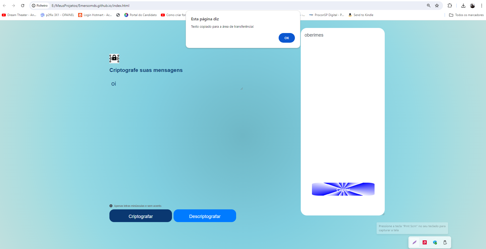

# Criptografia de Textos

Este projeto é uma aplicação web simples que permite a criptografia e descriptografia de textos. O usuário pode inserir um texto no campo apropriado, clicar nos botões para criptografar ou descriptografar, e copiar o resultado para a área de transferência.

## Funcionalidades

- **Criptografar Texto:** Substitui caracteres específicos do texto de entrada por sequências de caracteres predefinidas.
- **Descriptografar Texto:** Reverte a criptografia, retornando o texto ao seu estado original.
- **Copiar Texto:** Permite copiar o texto criptografado ou descriptografado para a área de transferência.

## Tecnologias Utilizadas

- **HTML:** Estrutura da página.
- **CSS:** Estilização da página.
- **JavaScript:** Lógica de criptografia, descriptografia e cópia de texto.

## Estrutura do Projeto
├── index.html  
├── css 
│ └── style.css  
├── js  
│ └── script.js  
└── img  
├── cryptography.png  
├── Group.png  
├── High quality products 1 1.png  
└── screenshot.png  

## Como Utilizar

1. Clone o repositório para a sua máquina local.
2. Abra o arquivo `index.html` em um navegador web.
3. Digite o texto que deseja criptografar ou descriptografar no campo de entrada.
4. Clique no botão "Criptografar" para criptografar o texto ou no botão "Descriptografar" para descriptografar o texto.
5. Use o botão "Copiar" para copiar o texto resultante para a área de transferência.

## Layout do Projeto

### Tela Inicial

### Texto Criptografado

## Autor

- [Emerson Matos ](https://github.com/Emersomds/Challenge_Decodificad)

## Licença

Este projeto está licenciado sob a [MIT License](LICENSE).